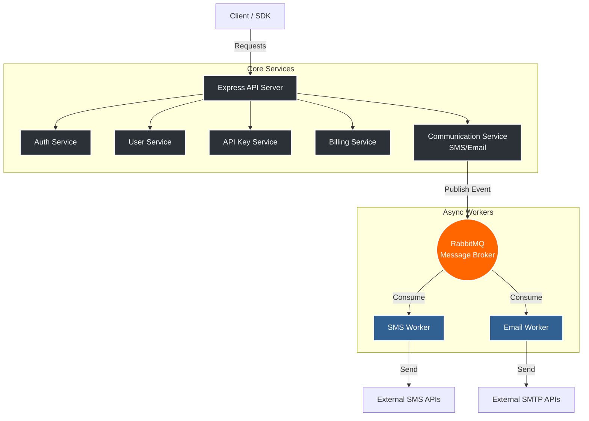

<div align="center">
  <h1>⚡ AxeDz Backend</h1>
  <p><strong>Cloud Communication Platform as a Service (CPaaS)</strong></p>
  
  
  
  
  
  
</div>

<br />

---

## 📑 Table of Contents
<details>
<summary>Click to expand</summary>

- [Overview](#-overview)
- [Architecture](#-architecture)
- [Tech Stack](#-tech-stack)
- [Core Modules](#-core-modules)
- [Billing System](#-billing-system)
- [Worker System](#-worker-system)
- [Database Design](#-database-design)
- [Security Architecture](#-security-architecture)
- [Performance Design](#-performance-design)
- [Error Handling & API Format](#-error-handling--api-format)
- [Environment Variables](#-environment-variables)
- [Future Vision & Improvements](#-future-vision--improvements)

</details>

---

## 📖 Overview

AxeDz is a Cloud Communication Platform (CPaaS) backend built with Node.js and Express.js. It provides unified APIs for SMS, email sending, API key management, wallet-based billing (DZD), and is designed for future extensibility (storage, AI tokens, etc.).

The system follows a semi-monolithic + worker-based architecture using RabbitMQ for asynchronous processing.

---

## 🏗 Architecture

The platform utilizes a message-driven workflow to decouple external API communication from the core Express server.



**Flow:** `Client` → `API Server` → `Services` → `RabbitMQ` → `Workers` → `External Providers`

---

## 💻 Tech Stack

| Category | Technologies |
| :--- | :--- |
| **Core Runtime** | Node.js, Express.js |
| **Database & ORM** | PostgreSQL / MySQL (Sequelize ORM) |
| **Messaging & Queues**| RabbitMQ |
| **Real-Time** | Socket.io |
| **Security & Auth** | JWT Authentication, bcrypt, Passport.js (Google OAuth), Helmet, CORS, Rate Limiting |
| **Integrations** | AWS S3, Nodemailer |

---

## 🧩 Core Modules

### 1. Authentication Service
- **Tokens:** JWT access & refresh tokens (Secure HTTP-only cookies).
- **OAuth:** Google OAuth login via Passport.js.
- **Verification:** OTP verification (SMS / Email) & Password reset system.
- **Security:** Built-in brute-force protection.

### 2. User Service
Handles profile management, account updates, password resets, and account state handling.

### 3. API Key Management
Each user can create multiple API keys per project used for authenticating CPaaS requests.
* **Structure:** `user_id`, `project_name`, `key` (UUID v4), `status` (active / revoked).

### 4. Communication Service (Core CPaaS Engine)
The central engine handling:
- SMS & Email sending
- Request validation & Cost calculation
- Event logging & Queue publishing to RabbitMQ

### 8. Logging & Event System
Tracks API requests, SMS/Email logs, Wallet transactions, Usage events, and System errors. Used for billing accuracy, analytics, debugging, and audit trails.

### 9. Contact Service
Store contacts with future capabilities for segmentation & campaigns.

### 10. Real-Time System (Socket.io)
Emits live events for **Wallet updates**, **Transaction status**, and **Notifications**.

---

## 💳 Billing System (Wallet - DZD)

A secure wallet-based billing system natively supporting **DZD**.

**Pricing:**
* 💬 **SMS:** 1.5 DZD  
* 📧 **Email:** 0.3 DZD

**Billing Flow:**
1. Validate API key ➔ Check wallet mode (free/paid).
2. Verify balance ➔ Create usage logs.
3. Deduct balance (if applicable) ➔ Store ledger transaction.
4. Emit real-time update ➔ Publish job to RabbitMQ.

### 💰 Payment System Integration (SATIM)
Handles real-time balance top-ups.

* `POST /payment/initiate`
* `POST /payment/status/:orderId/sync`
* `GET  /payment/history`
* `GET  /payment/transactions`
* `GET  /payment/wallet`

**Flow:** Initiate payment ➔ Store transaction ➔ SATIM confirmation ➔ Credit wallet ➔ Ledger update ➔ Real-time socket update.

---

## ⚙️ Worker System

Separating the execution layer ensures the API remains fast and non-blocking.

* **SMS Worker:** Consumes queue, sends SMS via provider, handles retry mechanisms, and logs failures.
* **Email Worker:** Sends transactional emails with template support and robust retry handling.

---

## 🗄️ Database Design

### Main Entities
`Users` | `Wallets` | `API Keys` | `Logs (SMS / Email)` | `Usage Events` | `Transactions` | `Payments` | `Contacts`

### Relationships
- **User ➔ Wallet:** `1:1`
- **User ➔ API Keys:** `1:N`
- **API Key ➔ Logs:** `1:N`
- **Wallet ➔ Transactions:** `1:N`

---

## 🛡️ Security Architecture

**Middleware Stack**
- **Helmet:** Enforces security headers.
- **CORS:** Strict domain whitelisting.
- **HPP & XSS:** HTTP Parameter Pollution protection and XSS sanitization.
- **Rate Limiting:** Protects endpoints from abuse.

**Authentication & API Key Security**
- Short-lived access tokens & HTTP-only refresh tokens.
- OTP verification & Brute-force protection.
- API keys are linked to wallets, required for all requests, revocable, and act as the billing identity.

---

## 🚀 Performance Design

- **Async Processing:** RabbitMQ offloads heavy API calls.
- **Worker Separation:** Decouples core logic from delivery mechanisms.
- **Stateless API:** Highly available API server.
- **DB Transactions:** Ensures consistency (especially critical for Wallet updates, Billing deductions, and Payment syncs).
- **Minimal Blocking:** Optimizes the Node.js event loop.

---

## 📡 API Format & Error Handling

All API endpoints follow a strict, predictable JSON format.

### Success Response
```json
{
  "success": true,
  "data": {
    "key": "value"
  }
}
```

### Error Response
```json
{
  "success": false,
  "message": "Detailed error description"
}
```

**Custom Error Classes:** `NotFoundError`, `AuthorizationError`, `ValidationError`.

---

## 🔐 Environment Variables

Required configurations to launch the platform:

```bash
# Database & Queues
DATABASE_URL=               # PostgreSQL/MySQL URL
RABBITMQ_URL=               # RabbitMQ connection string

# Security
JWT_SECRET=                 # Access token secret
JWT_REFRESH_SECRET=         # Refresh token secret
CORS_ORIGIN=                # CORS settings
RATE_LIMIT_WINDOW=          # Rate limiting config

# Integrations
SMTP_HOST=                  # SMTP configuration
AWS_S3_BUCKET=              # AWS S3 Storage
SMS_PROVIDER_API_KEY=       # External SMS provider
SATIM_API_KEY=              # SATIM payment gateway
```

---

## 🔮 Future Vision & Improvements

AxeDz is actively maintained and designed to evolve into a full-scale multi-service API ecosystem (similar to Twilio), encompassing a hybrid messaging/storage platform and AI token-based services.

### Roadmap
- [ ] **Redis caching layer** for faster API key validation.
- [ ] **API quotas** & limits per key.
- [ ] **Webhooks system** for delivery status receipts.
- [ ] **Dead-letter queue** (DLQ) for failed RabbitMQ jobs.
- [ ] **Monitoring** integration (Prometheus + Grafana).
- [ ] **Official SDKs** (Node / PHP / Python).
- [ ] **Developer Dashboard & Analytics system**.

---

<div align="center">
  <p><strong>Conclusion</strong></p>
  <p>AxeDz is a production-grade CPaaS backend featuring API key authentication, localized wallet-based billing (DZD), RabbitMQ worker architecture, secure authentication, and real-time updates in a highly scalable modular design.</p>
</div>
